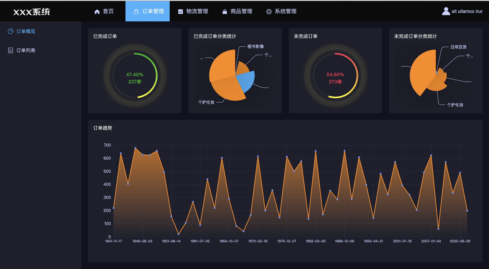
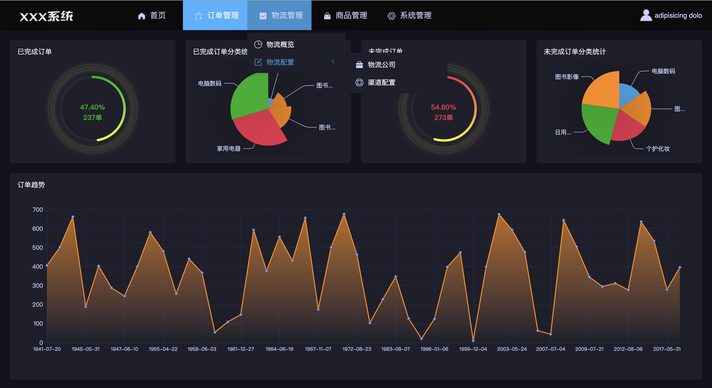
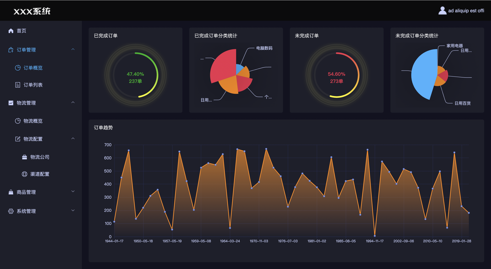
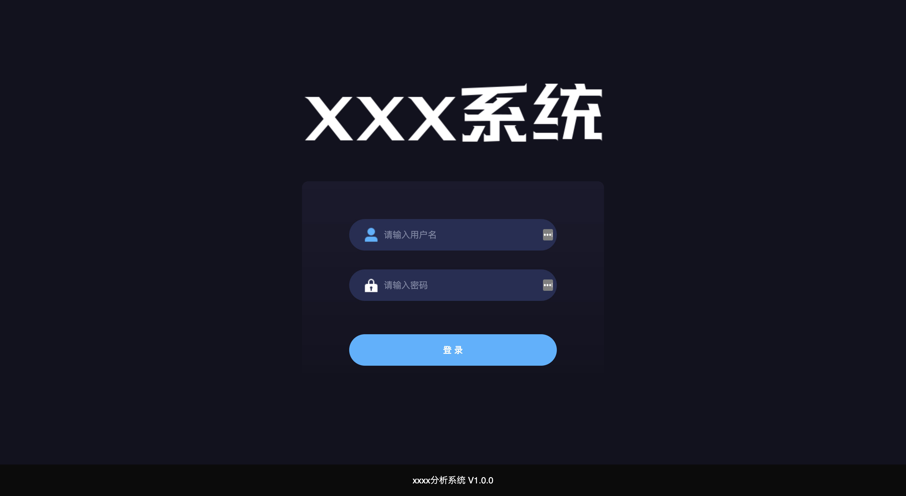
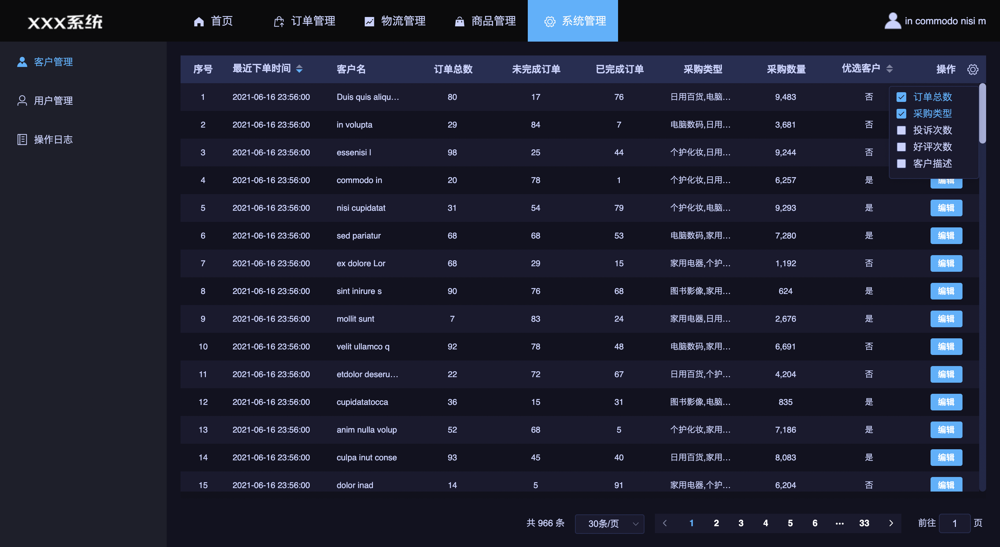
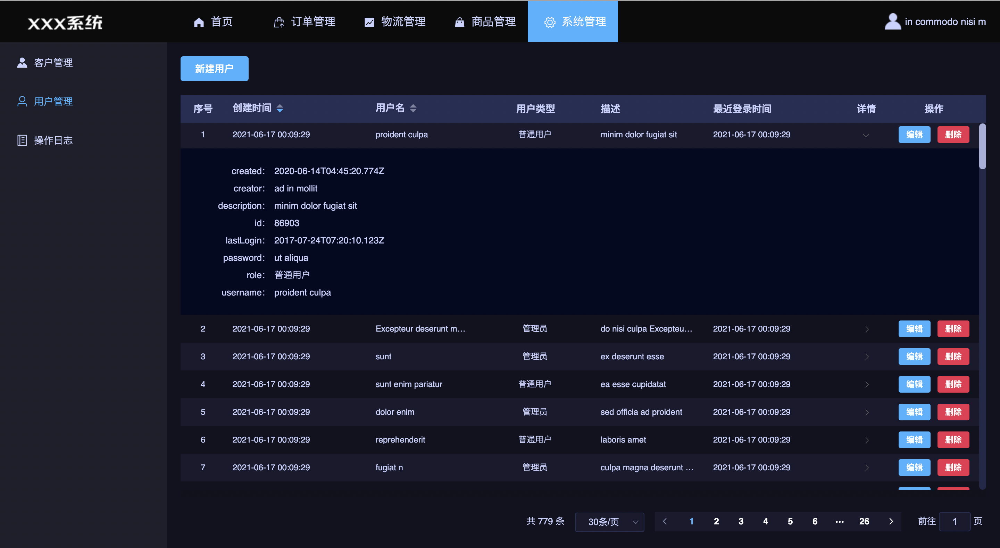
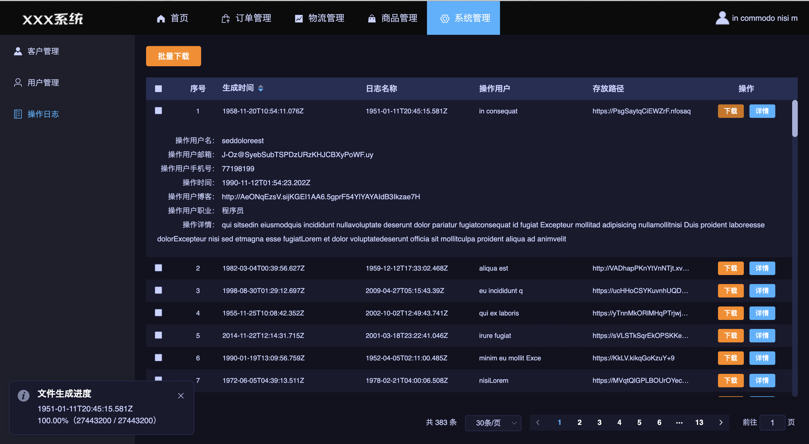
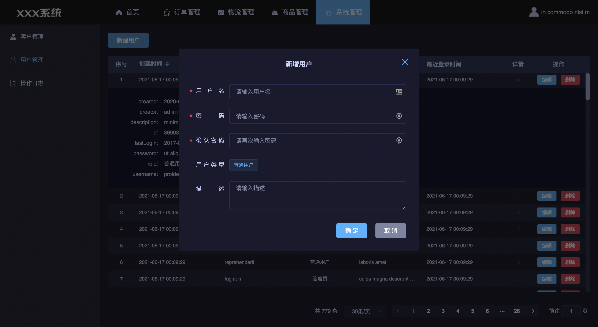
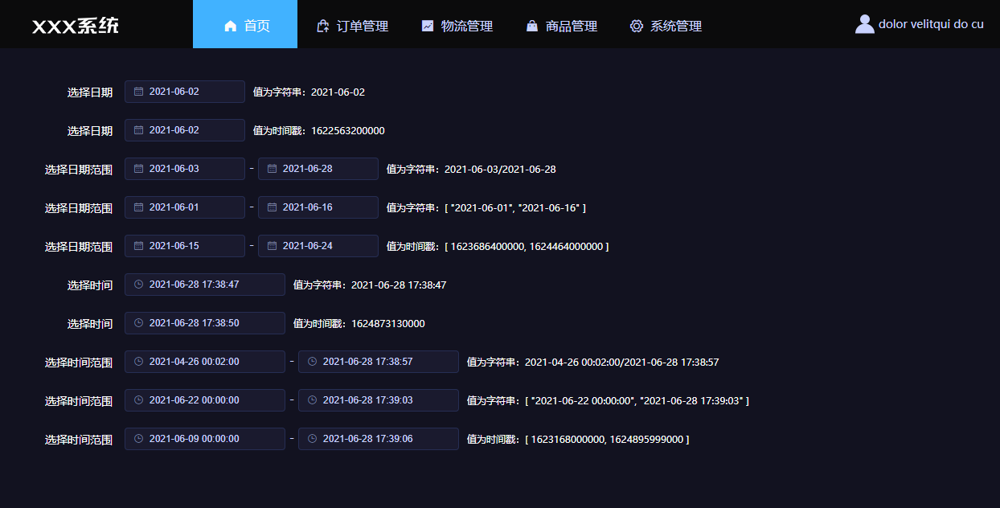

# vue2-elementui-layout 
> 本项目旨在快速开发后台管理系统，提供此类项目前端架构和部分常用功能组件的使用示例。
> 项目主要基于：vue2、elementui、axios、less、vuex、vue-router开发
## 1、项目主要功能
- 简洁的界面主题；
- eslint配置；
- 常用工具方法提供；
- 异步请求相关方法整合，接口文件整合；
- 路由的快速配置（含权限配置）；
- 根据路由配置，系统导航的配置（默认顶部+左侧导航，可选顶部导航或左侧导航）；
- 常用公共组件的提供：BaseDialog、BaseTable、BaseText、BaseDatePicker；
- 组件常用方法和数据提供：mixins；
- 表单自定义验证规则；
- 系统名、版本号、代理的统一配置；
- ...
## 2、项目目录结构说明
- dist 存放打包后的文件
- public
    - template 项目中使用的静态模板文件
- src
    - api 接口相关文件
        - 按功能模块命名的.js
    - assets
        - images
            - common
            - login
            - layout
            - ...
        - javascript 存放各模块单独引用的js，与mixins有差别
        - styles
          - theme 主题样式（element-ui官网生成）
          - 样式文件.less
    - components 系统公共组件
    - directives 全局注册的指令
    - filters 全局注册的过滤器
    - layout 界面布局模块
    - main 入口
    - mixins 按组件功能来分的混入，按需引用
    - pages 页面组件
        - 按功能模块来命名
            - components 这个模块公共组件
    - router
        - config.js 导航配置
        - index.js
        - routes.js 生成路由配置
    - store
        - index.js
        - modules 
    - utils 公用方法，全局引入
      - dict.js 字典，无必要的话可加入到混入里
      - request.js 异步请求公共方法
      - tool.js 公共方法
      - validator.js 表单自定义验证规则
    - .env 环境变量配置，一般情况下只需要这个文件就可以了
    - .env.development 开发环境环境变量配置
    - .env.production 生产环境环境变量配置
    - .eslintrc.js eslint配置
    - vue.config.js
    - webstorm.config.js 处理webstorm配置路径别名后，ctrl+左键失效
## 3、系统主要功能
几张系统功能截图，更多的功能还需要自己上手熟悉。
### 3.1 导航
#### 3.1.1 顶部+左侧导航

#### 3.1.2 顶部导航

#### 3.1.3 左侧导航

### 3.2 登录

### 3.3 表格
#### 3.1 含有表格的页面

#### 3.2 表格展开行效果

#### 3.3 表格下载

### 3.4 弹框

### 3.5 日期时间选择器

## 4、写在最后
如果启动不了或者某些地方报错请自己试着找问题，慢慢的就容易了。
大家在使用过程中，如果发现有需要改进和优化的地方，请在下方留言呀。
